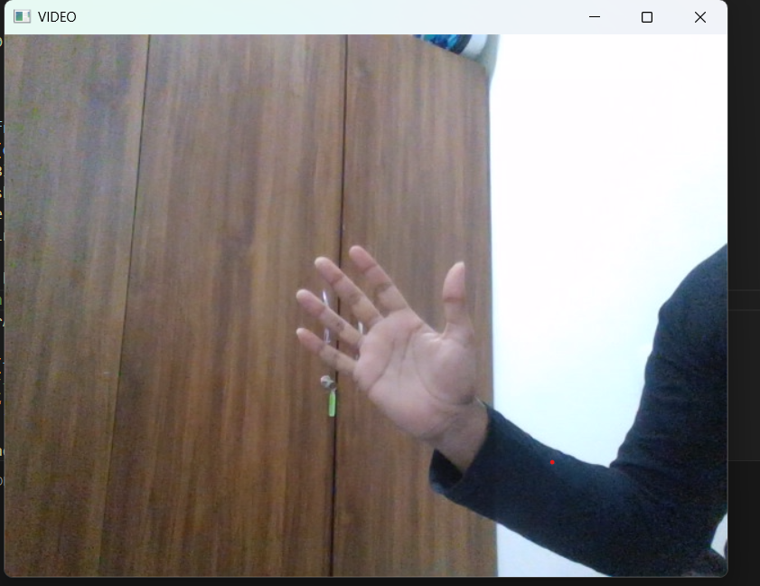
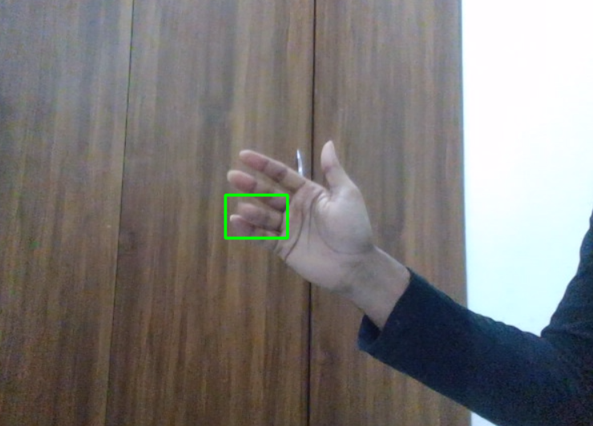

# Motion Detection Using OpenCV

## How it works??

The webcam continuously captures video frames.
Frames are converted to grayscale and blurred to reduce noise.
A reference frame is used to compare with the current frame.
The absolute difference between frames is calculated → areas of change represent motion.
Thresholding and contour detection are applied to identify moving objects.
Motion areas are highlighted with bounding boxes on the video feed.

## Features
Real-time motion detection using a live webcam feed.
Bounding boxes drawn around moving objects.
Simple and lightweight implementation using OpenCV.

## Example Output

